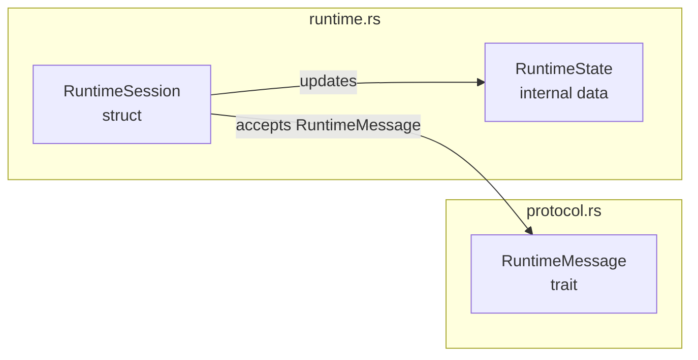

## Purpose

Maintain `.workflow.mmd` source-workflow companion diagrams for Rust source modules under `src/`.

This skill owns the mechanics of which `.workflow.mmd` files need updates and how each diagram must be shaped. It is intentionally decoupled from `.design.json` maintenance: `.design.json` is owned by `development-designer` / `design-json-update`, while this skill owns `.workflow.mmd` only.

## Trigger

- Use this skill ONLY when it is explicitly invoked: the user runs `/update-workflow`, or directly asks to update, refresh, or regenerate source-workflow diagrams.
- This skill is never triggered automatically. The `ensure-deveopment-design` `agentStop` hook does NOT check or require `.workflow.mmd`, and blocking a task never implies a workflow update.
- `development-designer` must NOT generate or edit `.workflow.mmd`. Workflow diagrams are out of that agent's scope.
- Do not invoke this skill proactively during unrelated tasks, hook blocks, or `git-tag` / `git-sync` flows.

## Inputs

- **Focused update** — The caller provides a list of changed design-tracked source paths under `src/`, plus the changed portions or intent. Update the changed file's module `.workflow.mmd` and every ancestor module `.workflow.mmd` up to `src/`.
- **Full update** — If invoked without a file list, walk `src/`, refresh every module `.workflow.mmd`, and create missing `.workflow.mmd` files for every design-tracked source folder.

## Path Rules

- A non-dot source path is any path under `src/` where neither the file name nor any parent directory segment starts with `.`.
- A design-tracked source path is a non-dot source path that is not under `src/tests/`.
- `src/tests/` contains integration tests. Ignore that folder completely: do not create `src/tests/.workflow.mmd`, and do not draw its files as nodes.
- Every dot-prefixed file or folder under `src/` is companion metadata and must not appear as a normal source node or path in diagrams.
- `.workflow.mmd` is Mermaid DSL, not Markdown. Do not generate, parse, or preserve any Markdown workflow format.

## Diagram File Selection

For a focused update:

1. Normalize the provided changed paths.
2. Keep only design-tracked source paths under `src/`.
3. For each changed file, update `.workflow.mmd` in:
   - the file's direct folder,
   - every ancestor folder,
   - up to and including `src/.workflow.mmd`.
4. If a changed path is a folder-level source change, update that folder and every ancestor up to `src/`.

For a full update:

1. Walk `src/`.
2. Ignore every dot-prefixed file/folder and the `src/tests/` folder.
3. Treat every remaining non-dot folder under `src/` as a source module.
4. Update or create `.workflow.mmd` in every source module folder.

## Diagram Responsibilities

- Maintain `.workflow.mmd` alongside `.design.json` in each module folder under `src/`, excluding `src/tests/`.
- Update the changed file's module `.workflow.mmd` and every ancestor module `.workflow.mmd` up to `src/` when source changes alter module element responsibilities, cross-element communication, data ownership, or execution flow.
- Use Mermaid `flowchart` syntax by default unless another Mermaid diagram type is clearly more accurate for the module.
- Represent module elements as graph nodes. Elements include concrete classes, public traits, structs, enums, public functions, type aliases, constants, statics, and important internal data structures that coordinate module behavior. Treat `pub`, `pub(crate)`, `pub(super)`, and `pub(in ...)` equally as outward-facing.
- Group nodes by source file or child module when that improves readability. Use repository-rooted labels or comments only when needed for disambiguation.
- Draw edges only for meaningful communication: calls through an interface, data structure ownership or mutation, protocol/message exchange, configuration/data flow, or lifecycle control.
- Edge labels should name the interface, protocol message, shared data structure, or runtime signal being exchanged.
- Do not draw element-internal operation details. Keep methods, branches, loops, and private helper steps inside an element out of the module-level workflow unless they are the communication boundary.
- Keep diagrams compact enough for the overview workflow popover. Prefer several clear edges over exhaustive call graphs.
- Use stable Mermaid node identifiers in English. Avoid spaces and punctuation in identifiers; put human-readable names in labels.
- Use `%%` Mermaid comments sparingly for module purpose or omitted detail notes.
- Do not include copied source code in `.workflow.mmd`.
- Do not include `src/tests/` or dot-prefixed source metadata paths in diagrams.

## Diagram Format

- Generate `.workflow.mmd` as Mermaid DSL, not Markdown. Do not wrap the content in Markdown code fences.
- Write diagrams in English.

Example:

## Validation

After updating:

1. Confirm every changed `.workflow.mmd` is valid Mermaid: a valid diagram header, no Markdown code fences, every `subgraph` closed by an `end`, and every edge endpoint declared.
2. Confirm no `.workflow.mmd` exists under `src/tests/` and no dot-prefixed source metadata path appears as a node in any diagram.
3. Confirm no `.workflow.mmd` content is wrapped in Markdown code fences.
4. For each changed design-tracked source module, confirm the diagram reflects the current module elements and their communication edges, and that ancestor diagrams up to `src/` stay consistent.

## Reporting

Report:

- input mode: focused or full,
- changed source paths considered,
- `.workflow.mmd` files updated or created,
- diagram nodes or edges intentionally omitted, if any,
- validation results.

## Rules

- Only edit `.workflow.mmd` companion files under `src/`. Do not edit `.design.json`, source code, package manifests, or any non-workflow file.
- Do not run git commands unless the user explicitly asks for a git operation.
- Write diagrams in English Mermaid syntax.
- Keep dot-prefixed workflow files as companion metadata; they must not become normal source files.
